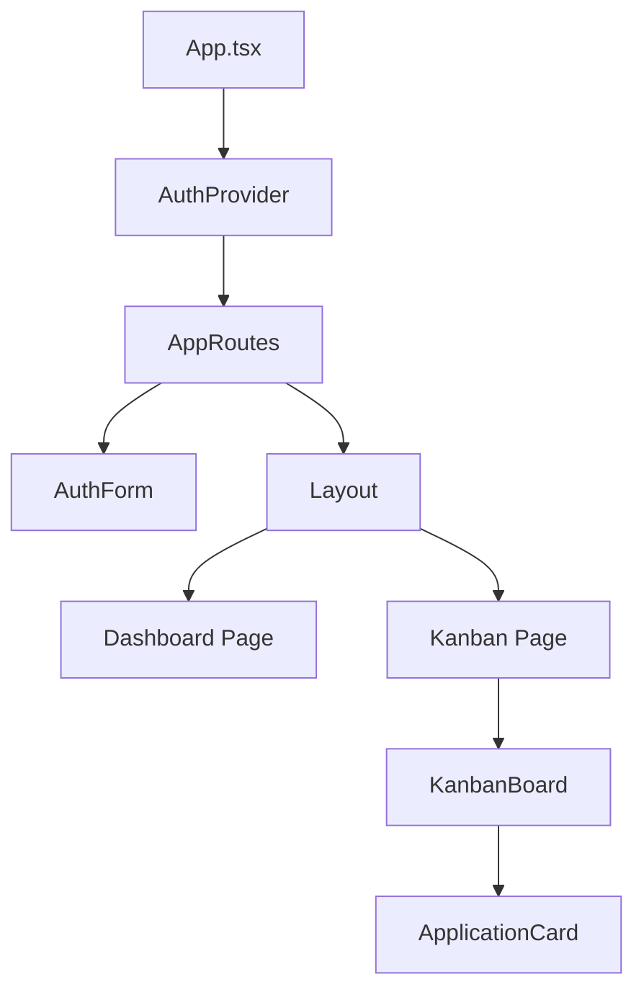
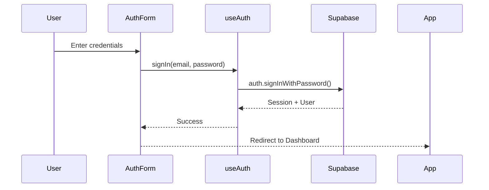
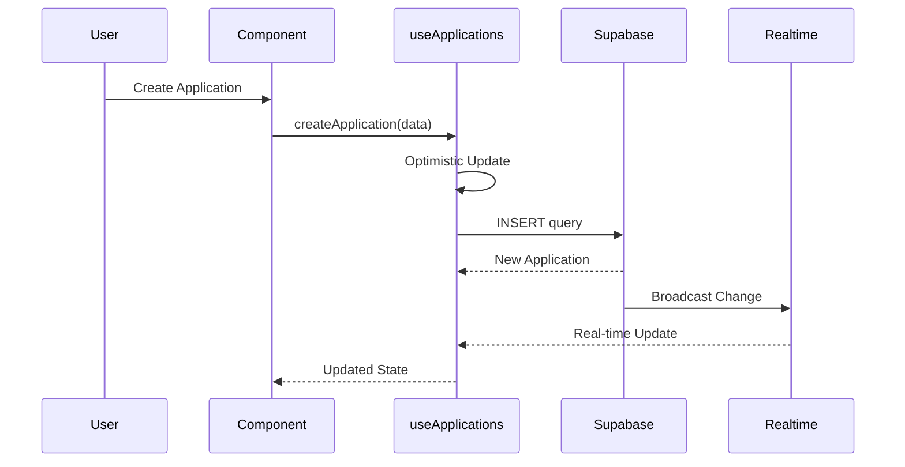
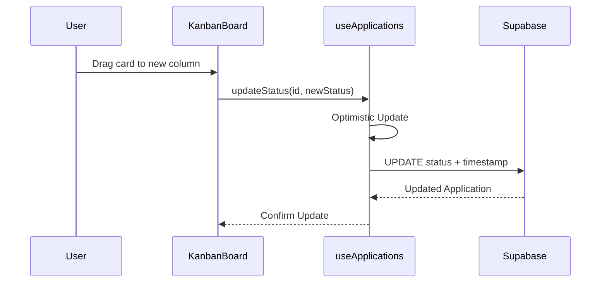
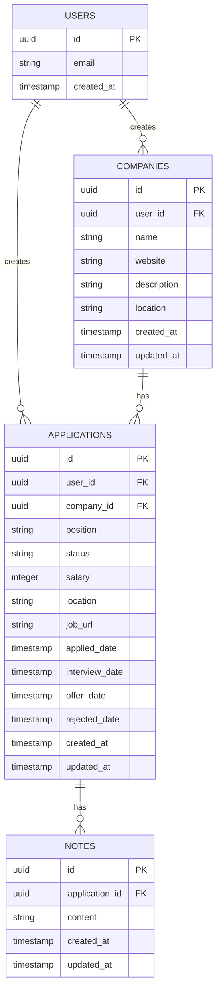
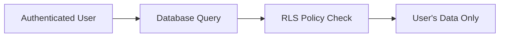
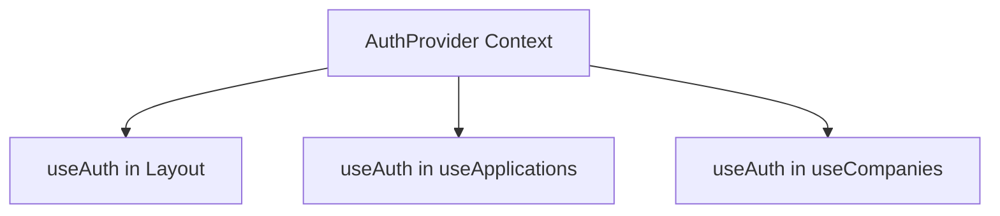
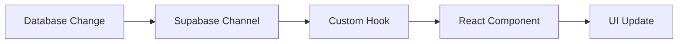
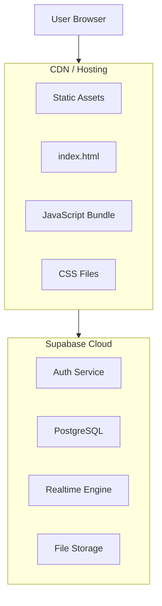

# Apply.come - System Architecture

## Overview

Apply.come is a full-stack job application tracking system built with a modern serverless architecture using React for the frontend and Supabase for the backend.

## Architecture Diagram

```mermaid
graph TB
    subgraph Client["Client Layer"]
        Browser["Web Browser"]
        React["React Application"]
        Router["React Router"]
    end

    subgraph State["State Management"]
        AuthContext["Auth Context"]
        CustomHooks["Custom Hooks"]
    end

    subgraph Components["Component Layer"]
        Pages["Pages"]
        Components["Reusable Components"]
        Layout["Layout"]
    end

    subgraph Backend["Backend Layer (Supabase)"]
        Auth["Supabase Auth"]
        Database["PostgreSQL Database"]
        Realtime["Realtime Subscriptions"]
        RLS["Row Level Security"]
    end

    Browser --> React
    React --> Router
    Router --> Pages
    Pages --> Components
    Components --> CustomHooks
    CustomHooks --> AuthContext
    CustomHooks --> Auth
    CustomHooks --> Database
    CustomHooks --> Realtime
    Database --> RLS
```

## Component Hierarchy



## Data Flow

### Authentication Flow



### Application CRUD Flow



### Kanban Drag & Drop Flow



## Database Schema



## Security Architecture

### Row Level Security (RLS)

All database tables implement RLS policies to ensure data isolation:

1. **User Isolation**: Users can only access their own data
2. **Cascading Policies**: Notes inherit access from applications
3. **Automatic Enforcement**: Enforced at database level



## State Management

### Context-based Authentication



### Custom Hooks Pattern

Each data entity has a dedicated hook:
- **useAuth**: Authentication state and methods
- **useApplications**: Applications CRUD + real-time
- **useCompanies**: Companies CRUD + real-time

## Real-time Updates



## Deployment Architecture



## Performance Optimizations

1. **Optimistic Updates**: Immediate UI feedback
2. **Real-time Subscriptions**: Live data without polling
3. **Database Indexes**: Fast query performance
4. **Memoization**: Prevent unnecessary re-renders
5. **Code Splitting**: Lazy load routes (future)

## Technology Decisions

### Why React?
- Component-based architecture
- Large ecosystem
- Excellent TypeScript support
- Virtual DOM for performance

### Why Supabase?
- PostgreSQL database (ACID compliance)
- Built-in authentication
- Real-time subscriptions
- Row Level Security
- Generous free tier

### Why Vite?
- Fast development server
- Optimized production builds
- Native ESM support
- Excellent TypeScript support

### Why Vanilla CSS?
- No build step overhead
- Full control over styling
- CSS custom properties for theming
- Modern CSS features (grid, flexbox, backdrop-filter)

## Scalability Considerations

1. **Database**: PostgreSQL scales vertically and horizontally
2. **Authentication**: Supabase handles auth scaling
3. **Real-time**: Supabase manages WebSocket connections
4. **Frontend**: Static files served via CDN
5. **Caching**: Browser caching + CDN caching
